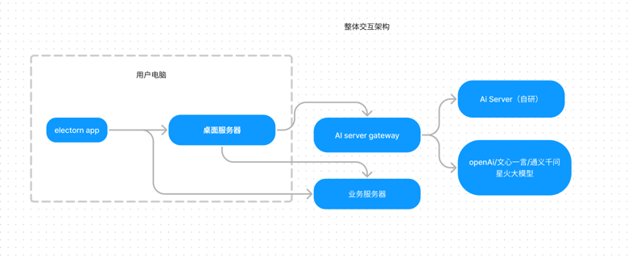

# 使用说明
## 文件结构
    chat2rs-business-server 是远程服务器代码，主要用来处理团队协作/登录操作/AI 接口
    chat2rs-server 是桌面服务器代码，主要用来和前端进行交互
    chat2rs-client 是electron 客户端
## 调试说明
是electron 客户端在启动时需要带动桌面服务器的启动，因此在 /app/jar 和 app/jre
中分别放的是桌面服务器包和运行需要的jre环境，为了方便调试，可以使用 build.sh 执行打包和将jre 解压到对应目录中
windos开发者可以自己写个bat脚本或者人工将需要内容放入对应目录
*  chat2rs-client/app/jar/chat2research.jar
*  chat2rs-client/app/jre  中是 java17 的JRE 文件

## 整体架构说明

## 存储
文档存储 ~/.chat2rs/docs/
